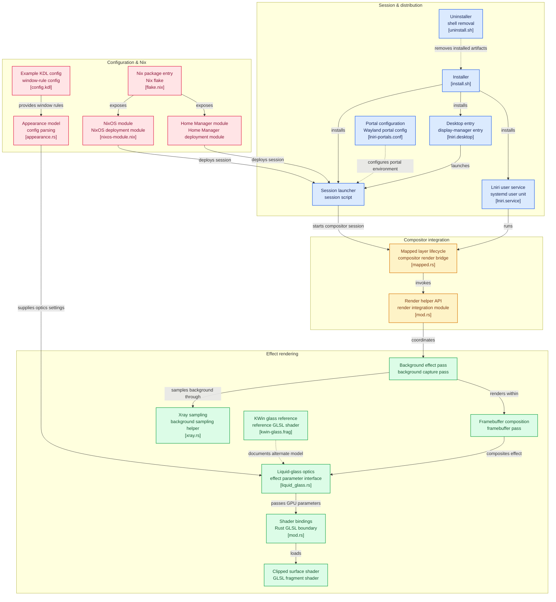

# Lniri - Liquid Glass Engine for Niri

- A liquid-glass optical refraction and background effect engine for the [Niri](https://github.com/niri-wm/niri) scrollable-tiling Wayland compositor.
     
https://github.com/user-attachments/assets/b98440ec-ffa4-47c4-9473-23d51ceb8d4d

https://github.com/user-attachments/assets/4df0c81e-beb1-4ede-903e-5af182120164

## Quick Start: One-Liner Install & Update

Install Lniri or update an existing installation directly with a single command:

```bash
bash -c "$(curl -fsSL https://raw.githubusercontent.com/TattvaOrg/Lniri/main/install.sh)"
```

### Why this installer is smart:
- **Side-by-Side Installation**: Installs as a separate `Lniri (Liquid Glass)` session alongside your standard `niri`. Both can be chosen at your login manager (GDM, SDDM, Ly, Greetd).
- **Auto-Detects Existing Installations**: Automatically switches into **Update Mode** and lets you choose between:
  - **1) Main branch**: Cutting-edge upstream commits.
  - **2) Latest release**: Stable tagged releases of Niri.
- **Persistent Build Cache**: Maintains the Niri source and build cache in `~/.local/share/lniri/niri/target`. Subsequent runs and updates compile incrementally in seconds without recompiling all dependencies from scratch.
- **Hands-Free**: Prompts for `sudo` once at the beginning and keeps the session active in the background until installation finishes.

---



## How to Launch

1. **From your Display Manager (GDM, SDDM, Ly, Greetd):**  
   Select **Lniri (Liquid Glass)** from the session dropdown.

2. **From a TTY:**
   ```bash
   exec /usr/local/bin/lniri-session
   ```

3. **Standalone binary:**
   ```bash
   lniri
   # or
   Lniri
   ```
   
---

## Configuration & Terminal Setup

> **Looking for complete terminal configs (Alacritty, Kitty, Ghostty), wallpaper daemon setups, and ready-to-use presets?**  
> Check out the [**Complete Setup Template & Guide (template.md)**](template.md).  
> **Looking for detailed shader optics, KWin Glass presets, and parameters?**  
> See the [**Shader Guide & Reference (shaders.md)**](shaders.md).

Lniri reads standard Niri configuration files in the following order:
1. `~/.config/lniri/config.kdl`
2. `~/.config/niri/config.kdl` (seamless fallback for existing configs)
3. Custom path via `$LNIRI_CONFIG` or `$NIRI_CONFIG`

>[!IMPORTANT]
> After installing it, your niri will show an error because you are editing a niri/config.kdl, so make sure that to use your niri again, remove all Lniri config from config.kdl. By only this, your main niri will work again, and to validate it, use lniri validate

### Basic Liquid Glass Window Rule

Add the following to your `config.kdl`:

```kdl
// Enable rounded corners (crucial for curved glass refraction)
window-rule {
    geometry-corner-radius 12
    clip-to-geometry true
}

// Liquid glass rule for your terminal (Alacritty / Kitty)
window-rule {
    match app-id="Alacritty"
    draw-border-with-background false
    background-effect {
        blur false
        xray true
        liquid-glass {
            liquidity 0.8
            refraction-strength 4.0
            power-factor 3.5
            refraction-power 1.5
            glow-weight 0.0
            edge-lighting 0.5
            saturation 1.1
            vibrancy 0.35
            adaptive-dim 0.0
            adaptive-boost 0.0
            physical-refraction 0.0
            lens-distortion 0.2
            fringing 0.4
        }
    }
}
```

---

## [Ideas](https://github.com/TattvaOrg/Lniri/tree/main/ideas)
<table>
  <tr>
    <td>

    </td>
    <td>

    </td>
  </tr>
</table>

---

## Parameters Breakdown

| Parameter | Type | Typical Range | Description |
| :--- | :--- | :--- | :--- |
| `mode` | string | `"kwin-glass"` or `"liquid"` | Shader engine toggle. `"kwin-glass"` runs the authentic Snell's law + caustic bevel + Oklab pipeline; `"liquid"` runs the fluid water-drop pipeline. Defaults to `"liquid"`. |
| `liquidity` | float | `0.0` – `2.0+` | (`mode "liquid"`) Controls fluid water-drop optics intensity. `0.0` = standard glass, `1.0` = deep liquid water-drop reflection with surface-tension curvature and central magnification (matching kwin-effects-glass rose terminal), `2.0+` = extreme fluid distortion. |
| `refraction-strength` | float | `1.0` – `6.0` | Overall magnitude of the optical refraction ($IOR = 1.0 + \text{strength}$). |
| `power-factor` | float | `2.0` – `15.0` | Falloff curve from the window edge inward (lower = wider glass bevel). |
| `refraction-bevel-intensity` | float | `1.0` – `20.0` | (`mode "kwin-glass"`) Caustic bevel steepness & displacement depth. Default `10.0`. |
| `refraction-offset-strength` | float | `1.0` – `20.0` | (`mode "kwin-glass"`) Corner optical curvature distortion. Default `8.0`. |
| `edge-thickness` | float | `0.05` – `0.35` | Meniscus / bevel border width relative to window dimensions. Default `0.18`. |
| `oklab-saturation` | float | `0.0` or `1.0` | (`mode "kwin-glass"`) Set `1.0` to enable Oklab perceptual color space saturation. |
| `refraction-power` | float | `0.5` – `2.0` | (`mode "liquid"`) Exponential power applied to displacement vectors. |
| `fringing` | float | `0.0` – `1.0` | Chromatic dispersion (RGB prism fringing along edges). |
| `edge-lighting` | float | `0.0` – `1.0` | Blends wallpaper colors dynamically onto window borders. |
| `glow-weight` | float | `0.0` – `0.6` | Dual-highlight and shadow rim profile intensity along the glass boundary. |
| `saturation` | float | `0.5` – `1.5` | Color saturation multiplier of the refracted background. |
| `vibrancy` | float | `0.0` – `0.5` | Luminance and vibrancy boost for glass substrates. |
| `adaptive-dim` | float | `0.0` – `0.5` | Darkens glass over very bright wallpapers for readability (`0.0` for pure clear glass). |
| `adaptive-boost` | float | `0.0` – `0.5` | Lightens glass over very dark wallpapers. |
| `physical-refraction` | float | `0.0` or `1.0` | (`mode "liquid"`) `0.0` = SDF normal mode; `1.0` = center-directed Snell mode. |
| `lens-distortion` | float | `0.0` – `0.5` | Subtle barrel lens distortion across the window surface. |

> [!TIP]
> Standalone GLSL shader available at [`resources/shaders/kwin-glass.frag`](file:///home/cachy/github-p/github-based/glass/Lniri/resources/shaders/kwin-glass.frag).

---

## Manual Installation (from Git)

```bash
git clone https://github.com/TattvaOrg/Lniri.git
cd Lniri
./install.sh
```

---

## Uninstallation

To cleanly remove Lniri and its Wayland session files while leaving standard Niri intact:

```bash
./uninstall.sh
```

---

## Credits & License

- Liquid glass kwin shader effects take from [kwin-effects-glass](https://github.com/4v3ngR/kwin-effects-glass) and project infra is based on [Niri-glass](https://github.com/zaroutt/Niri-glass) rust base and glsl shaders are heavily modified.
